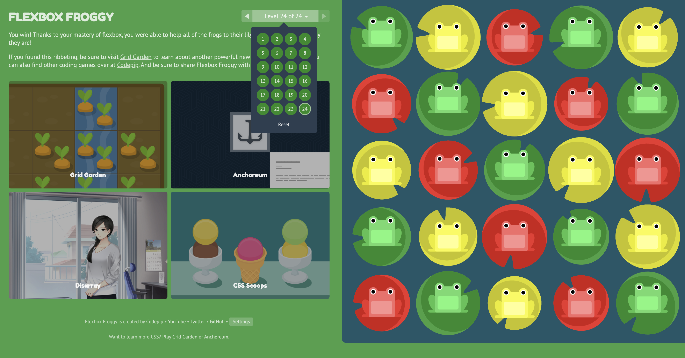
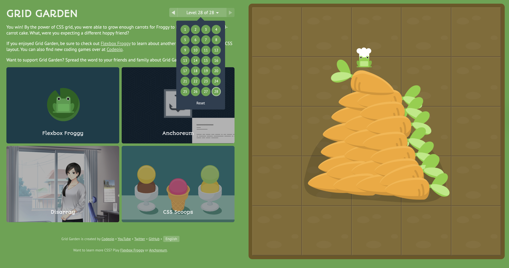

# is120-hw6-aaron-garry

CSS Flexbox and Grid

Images of completed tasks

SURVEY COMPLETED

The main difference between flexbox and grid is that flexbox items travel in one direction. Either across in a row or vertically in a column. Although you can make the items start to stack using wrap, it is difficult to work in two dimensions. Grid separates the page into sections like a spreadsheet or other grid. The columns and rows dimensions can be set and titled to easily style. This is much more useful for full page layouts and sizing while flexbox is good for something like cards in a row or items in one column. 

I find that grid seems to be a little more straight forward when it comes to styling your page as a whole but I can see why it would become complicated when using it on specific items. I found flexbox to have a lot more uses when it came to styling a card or organizing items in a specific part of the page. Overall I would say I like flexbox more because of how helpful it is to making things line up and center nicely. 
